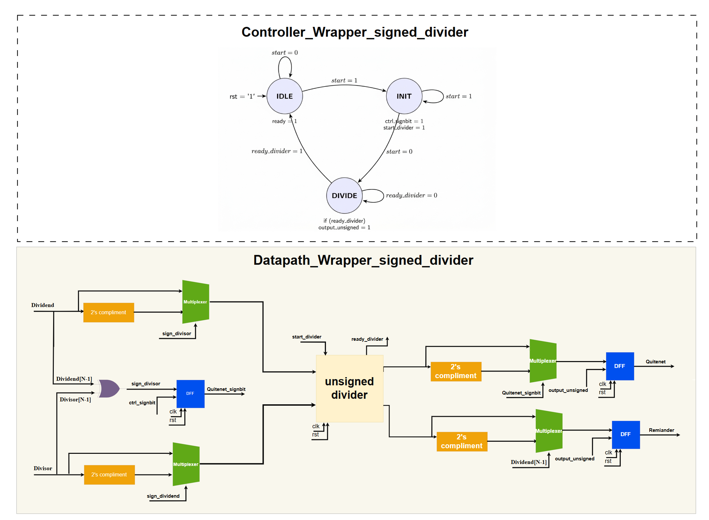
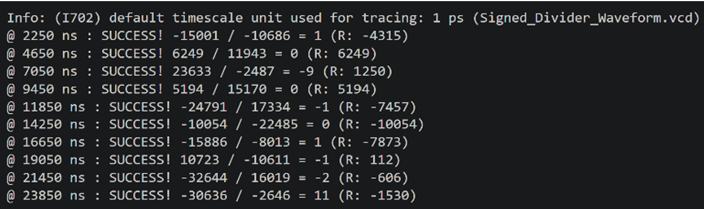
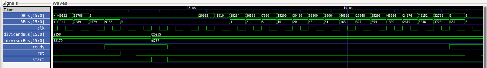
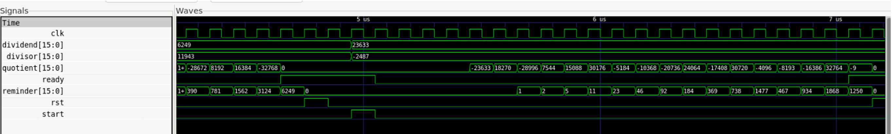

# Parameterized Sequential Restoring Divider in SystemC

A cycle-accurate hardware design of a sequential restoring divider in **SystemC (C++17)**, spanning RTL architecture, signed wrapper, Bus-Functional Model (BFM), and co-simulation verification.

---

## 🏛 Architecture

| Top View | Unsigned Divider (Datapath & FSM) |
| :---: | :---: |
|  |  |

### Signed Wrapper Architecture
Encapsulates the unsigned RTL core with 2's complement logic to handle signed operands without modifying the internal core:

  

---

## 📐 Algorithm

The restoring division algorithm iteratively computes quotient ($Q$) and remainder ($R$) such that:
$$Z = D \cdot Q + R \quad (0 \le R < |D|)$$

**Per-iteration steps ($N$ cycles):**
1. **Left-Shift:** Shift register pair $[R, Q]$ left by 1 bit:  
   $R' = (R \ll 1) \mid Q_{N-1}$
2. **Trial Subtraction:**  
   $\Delta = R' - D$
3. **Restoring / Update:**  
   - If $\Delta \ge 0 \rightarrow R = \Delta, \; Q_0 = 1$
   - If $\Delta < 0 \rightarrow R = R', \; Q_0 = 0$

---

## 📊 Simulation & Waveforms
Execution Results

Cycle-accurate handshaking and verification against randomized test vectors:

  

Waveforms (GTKWave)

Timing diagrams demonstrating execution for both unsigned and signed divider configurations:

  

  

